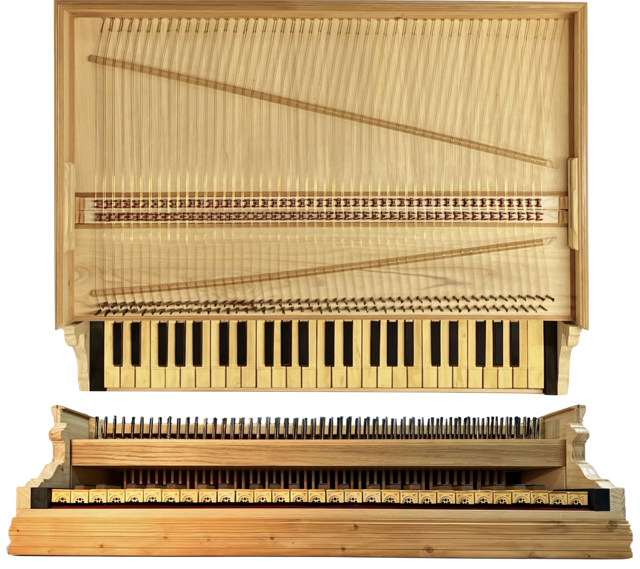
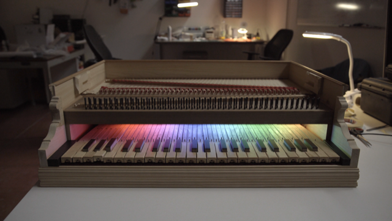
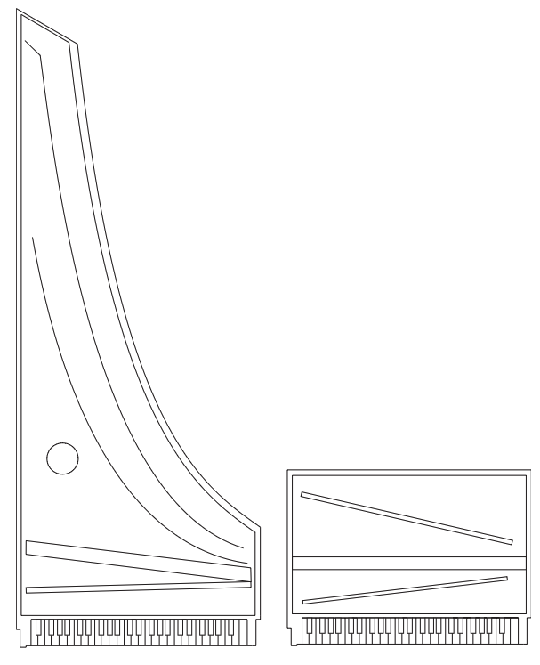
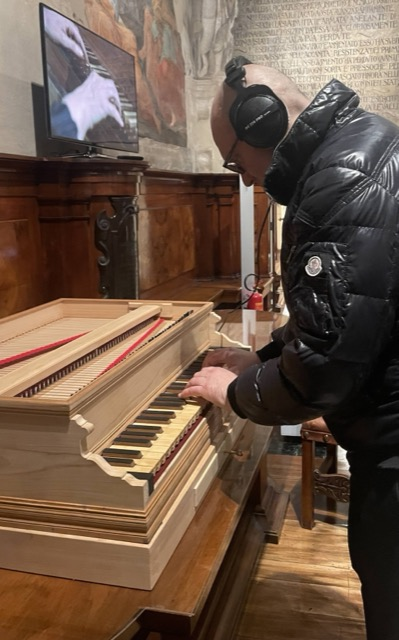

# Introduction

<figure id="fig:49-key">

<figcaption>Augmented replica keyboard interface</figcaption>
</figure>

Musical instruments present a uniquely challenging problem within the
heritage sector. Unlike many heritage objects, they are both aesthetic
artifacts and functional tools for producing music. This duality
complicates conservation approaches if there is to be a balance between
instrument’s physical integrity and its functional capability as a
sound-producing device. This balance is central to understanding the
broader philosophical and practical questions involved in the
conservation of musical instruments, and it invites a re-examination of
traditional frameworks to better encompass their hybrid nature. This
article will discuss the nature of musical instruments as heritage
objects and presents a recent project at Museo San Colombano in Bologna,
Italy, for which a new augmented replica harpsichord keyboard interface
(Figure <a href="#fig:49-key" data-reference-type="ref"
data-reference="fig:49-key">1</a>) was created. The goal of the project
was to reintroduce the experience of playing historical keyboard
instruments. This project embodies the intersection of conservation
philosophy, technical innovation, and museum practice, providing a
practical case study on how living interaction with heritage instruments
might be facilitated while safeguarding their material and cultural
values.

# Living vs Dead Heritage

Over recent decades, there has been a greater discourse around ‘living
heritage’ versus the static, preservable ‘dead’ heritage (Poulios 2010;
Smith 2006).

Poulios critiques values-based conservation for treating the past as
something ‘dead,’ resulting in a discontinuity between past and present
experiences (Poulios 2010). In contrast, the ‘living heritage’ paradigm
emphasizes the ongoing, dynamic use and relevance of heritage,
advocating for the preservation of not just physical artifacts but the
practices, skills, and meanings that sustain them in contemporary life.

While Poulios’ arguments are primarily directed at heritage sites and
ceremonial objects, the underlying philosophy is applicable to the wider
umbrella heritage objects, particularly musical instruments. There is
false dichotomy that presents conservation as a choice between heritage
as static and ‘dead’ or ‘living’.[1]. The reality is more complex and to
treat heritage as perpetually living without acknowledging its material
finitude risks creating an ‘undead’ heritage, neither truly alive nor
preserved.

# A New Value for Conservation

The justification for conserving heritage objects often rests upon a
complex matrix of values. Avrami et al. ((2000)) provide a collection of
value systems that underpin conservation decisions across different
disciplines and organizations, summarized in Table
<a href="#tab:values_comparison" data-reference-type="ref"
data-reference="tab:values_comparison">1</a>.

width=

<table>
<caption>Comparative Analysis of Value Systems in Heritage Conservation
(Avrami, Mason,
and Torre 2000).</caption>
<tbody>
<tr>
<td style="text-align: left;"><strong>Art History</strong></td>
<td style="text-align: left;"><strong>ICOMOS Australia</strong></td>
<td style="text-align: left;"><strong>Economics</strong></td>
<td style="text-align: left;"><strong>English Heritage</strong></td>
</tr>
<tr>
<td style="text-align: left;">Alois Reigl</td>
<td style="text-align: left;">Burra Charter</td>
<td style="text-align: left;">Bruno Frey</td>
<td style="text-align: left;"></td>
</tr>
<tr>
<td style="text-align: left;">1902</td>
<td style="text-align: left;">1998</td>
<td style="text-align: left;">1997</td>
<td style="text-align: left;">1999</td>
</tr>
<tr>
<td style="text-align: left;">Age</td>
<td style="text-align: left;">Aesthetic</td>
<td style="text-align: left;">Monetary</td>
<td style="text-align: left;">Cultural</td>
</tr>
<tr>
<td style="text-align: left;">Historical</td>
<td style="text-align: left;">Historic</td>
<td style="text-align: left;">Option</td>
<td style="text-align: left;">Educational and academic</td>
</tr>
<tr>
<td style="text-align: left;">Commemorative</td>
<td style="text-align: left;">Scientific</td>
<td style="text-align: left;">Existence</td>
<td style="text-align: left;">Economic</td>
</tr>
<tr>
<td style="text-align: left;">Use</td>
<td style="text-align: left;">Social (including spiritual, political,
national, other cultural)</td>
<td style="text-align: left;">Bequest</td>
<td style="text-align: left;">Resource</td>
</tr>
<tr>
<td style="text-align: left;"></td>
<td style="text-align: left;"></td>
<td style="text-align: left;">Prestige</td>
<td style="text-align: left;">Recreational</td>
</tr>
<tr>
<td style="text-align: left;"></td>
<td style="text-align: left;"></td>
<td style="text-align: left;">Educational</td>
<td style="text-align: left;">Aesthetic</td>
</tr>
</tbody>
</table>

In addition to those above, I propose as a new category for musical
instruments and potentially all heritage objects that embody craft and
practice: ‘instructional value’. Instructional value refers to the
capacity of a heritage object to convey knowledge of practice,
technique, and skill intrinsic to its use and creation. A painting or
sculpture may reveal insights into artistic methods through ‘witness
marks’, the traces of the artist’s hand or materials. Similarly, a
musical instrument can serve as a pedagogical tool for performers,
luthiers, and scholars, instructing through its construction, wear
patterns, and interaction how music was historically produced and
experienced.

Instructional value may superficially appear to be a subset of
educational or academic value. I argue that this conflation obscures a
critical distinction between ‘descriptive knowledge’ (knowing that) and
‘procedural knowledge’ (knowing how). This division is essential to
resolving tensions in musical instrument conservation, where preserving
the physical object alone cannot fully capture its performative essence
without maintaining or reviving the skills and practices it embodies.

The discourse around conservation frequently centres on the notion of
‘authenticity’ (Pine II and Gilmore 2007; Laurenson 2006), particularly
regarding historically informed performance (Davies 2001). Setting aside
the complexities and debates surrounding the meaning of ‘authenticity,’
it is important to recognize that the audience’s experience often
dominates discussions of musical heritage. Yet, consider a scenario
where a performer rehearses a piece 50 times before performing to an
audience of 50 who hears it once. Which value was represented and by
what magnitude in the course performance? I would argue the performer’s
experience – informed by the instrument’s unique qualities – carries
significant instructional value which is equal or greater in magnitude
to those values relevant to audience.

The performer, through hours of embodied interaction, acquires a richer,
more nuanced understanding, gained through tactile feedback and
‘gestural repertoires’ (Levinson 2011) intrinsic to playing the
instrument. The instrument shapes the performance as much as the
performer shapes the music. This interplay is especially salient when
comparing, for instance, a modern Steinway piano with a historical
harpsichord, where differences in touch, sound production, and response
create distinct musical experiences. Put simply, this yet another
example of McLuhan’s maxim that “the medium is the message” (McLuhan and
Gordon 2003).

Conventional museum practice rarely permits visitors to handle or play
historical instruments. Though instruments may be in ‘playing condition‘
they are not typically playable by the average museum visitor. Instead,
instruments cordoned off behind a – real or imagined – ‘red velvet
cord,’ (McAlpine 2014) displayed as objects to be seen but not touched.
This approach robs visitors of the experience of vibro-tactile and
kinaesthetic cues encoded into the interface of the instrument. The
challenge, then, is how to reintroduce embodied interaction with
historical instruments in ways that respect conservation imperatives
while restoring some degree of their living function.

# Musical Instruments and Authenticity

Conserving musical instruments also raises the philosophical puzzle akin
to the ‘Ship of Theseus’. If an object’s components are replaced one by
one over time, at what point does it cease to be the original? For
instruments, how many keys, valves, bridges can be substituted? How many
patches and struts can be glued to soundboards before the instrument
ceases to historically authentic?

Laurenson ((2006)) addresses authenticity by suggesting that the
significance and function of each component must guide decisions about
conservation and change. However, this approach simply ‘kicks the can
down the road.’ For example, Laurenson discusses the Walkman in Angus
Fairhurst’s artwork *Gallery Connections*, noting that its high value
and obsolescence require preserving the original artifact while
replicating its function through other means (Laurenson 2005). This
approach demands further reflection when applied to historical musical
instruments already past the point of indefinite preservation while
retaining function.

Davies’ ((2001)) treatment of authenticity and substitution in musical
performance is influential but problematic in (Laurenson 2006).

> “Where the change in instrumentation, and adaptations made to the
> music in the light of this, are significant, the result is a work
> transcription that is distinct from its model. One does not transcribe
> a work merely by crossing out the word ‘harpsichord’ on the score and
> replacing it with ‘piano’ \[...\] however. Neither does the
> substitution of the modern cello for its Baroque cousin result in a
> work transcription.”

– (Davies 2001, 222)

Davies comparison conflates differences of degree (‘Baroque’ and modern
cello) with kind (harpsichord and pianoforte). The harpsichord and
pianoforte share a keyboard but employ fundamentally different
mechanisms for string excitation (plucking multiple registers vs. a
single hammer) resulting in a qualitative difference in the
vibro-tactile response. Conversely, the baroque and modern cello are
both bowed string instruments with identical excitation physics, despite
evolving dimensions and construction details.[2] Davies misunderstanding
combined with confusion over Levinson’s emphasis on ‘gestural
repertoires’ (Levinson 2011) provide an example of the precariousness of
‘authenticity‘ and its citation in (Laurenson 2006) show the
consequences of its misapplication.

Davies also writes:

> “It is relevant to add a second observation to this first: period
> instruments, when played in the style of the day, sound different from
> modern ones, but, as well, they sound better. They make clearer or
> more salient features of the work that are aesthetically significant.”

– (Davies 2001, 218)

To allow some leniency to Davies, there have scientific been studies
exploring these ideas, but they do result in Davies assessment here
being objectively incorrect. Given the recent studies by Fritz et al.
((2012, 2014, 2017)) on old violins – and assuming it is not a stretch
to apply the same conclusions to other string instruments – Davies
assessment here is objectively incorrect. This brings us back to the
instructional value of historical instruments: they are finite, their
sounds do not age well, they cannot be simply substituted without
compromise. How do we maintain a historical instruments capacity to
teach and communicate performance practice when it is deeply embedded in
their material and functional characteristics? If substitutions or
restorations alter these features, they risk severing vital links to
past knowledge and experience. The Tagliavini Collection in Bologna
(Tagliavini et al. 1987), housed at Museo San Colombano - Genus Bononiae
and renowned for its historical keyboard instruments, exemplifies this
dilemma.

# Museo San Colombano Exhibition

<figure id="fig:mark2">

<figcaption>Electronically Augmented Keyboard Interface. Colour LEDs are
hidden from visitors by the name plate. These LEDs were used in the
development and calibration process for visual feedback of key
states.</figcaption>
</figure>

With over fifty early keyboard instruments, primarily early plucked
stringed keyboards of Italian origin, the Tagliavini Collection stands
out as a valuable resource for musicologists, organologists and
musicians alike. Preserving the instruments’ authenticity was the
cornerstone of Ferdinando Tagliavini’s vision. This guiding principle
led him to collect instruments that could be restored to their playing
condition after minimal intervention.

In a collaboration between Museo San Colombano and the NEMUS project, we
designed an electronically augmented replica of a historical harpsichord
keyboard for interaction with digital musical instruments (Figure
<a href="#fig:49-key" data-reference-type="ref"
data-reference="fig:49-key">1</a>
<a href="#fig:mark2" data-reference-type="ref"
data-reference="fig:mark2">2</a>). The goal was to enable visitors to
experience the harpsichord’s unique vibro-tactile qualities without
risking damage to the original artifacts and offer an immersive learning
environment. The keyboard incorporates an optical sensor system and
digital sound synthesis to replicate the physical feedback and acoustic
response of an original 15th century harpsichord in the Italian style.

<figure id="fig:log-harp-comp">

<figcaption>Scale comparison between a 15th Century logarithmic shape
and the new keyboard interface.</figcaption>
</figure>

This new interface builds on the work of McAlpine ((2014)) with the
Benton Fletcher Collection. However, user tests identified a limitation:
the commercially available weighted keys failed to provide an authentic
sense of interacting with a historical plucked keyboard instrument
(McAlpine 2014). The “Tromba Moderna” project (Baldwin et al. 2016)
approached the issue of musical heritage playability by recreating and
augmenting a replica of a historical tromba marina. A piezo transducer
was connected to a sound synthesis engine and a driver within the
instrument to simulate the expected vibrations of a historical tromba
marina. The new keyboard inherits some aspects from the Tromba Moderna
project and addresses the limitations on the project by McAlpine. The
optical sensing technique for the keyboard is adapted from a similar
project on the piano by McPherson (McPherson 2013).

The aesthetics of the interface attempt to leverage the human tendency
to be influenced by visual elements when making musical judgments (Tsay
2013; Fritz et al. 2012, 2014, 2017) and enhance its likelihood of being
perceived as an ‘authentic’ by visitors. The rectangular frame deviates
from the traditional logarithmic (Figure
<a href="#fig:log-harp-comp" data-reference-type="ref"
data-reference="fig:log-harp-comp">3</a>) form as the interface needed
be compact enough not to compromise space for exhibition of the
permanent display. The keyboard is hosted in the Oratory above the
museum’s main hall (Figure
<a href="#fig:installed" data-reference-type="ref"
data-reference="fig:installed">4</a>) alongside unique examples of the
Italian Renaissance building tradition, including the 1547 harpsichord
and the 1540 spinet by Alessandro Trasuntino.

<figure id="fig:installed">

<figcaption>Installation of the new keyboard in the Oratory, San
Colombano.</figcaption>
</figure>

The interface is presently linked to a commercial software sampler;
however, the ultimate aim is to make the sound of instruments in the
collection that can no longer be maintained in playable condition
accessible. Museum visitors are invited to play the interface and listen
through a pair of headphones (Figure
<a href="#fig:user" data-reference-type="ref"
data-reference="fig:user">5</a>).

# Conclusion

The exhibition opened February 2025 and since then there have been two
rounds of preliminary feedback collected. The first from a pool of 20
people – consisting of staff, surveillance personnel and visitors who
were given training on the system – and expert feedback from curator
Catalina Vicens and luthier Roberto Livi. The second round as part of a
wider survey of the exhibition on a group of approximately 50 PhD
students. This survey was in a five-point scale format the results of
which are still being collected. From this group it was observed that
some did not play the interface. When these visitors were later asked
why they did not play the reasons given were that did not think they
were allowed to touch the instrument. This could be considered in
compliment for accuracy in the aesthetics of the keyboard but may also
suggest a wider problem with encouraging interaction in the museum
context.

<figure id="fig:user">

<figcaption>Visitor to the exhibition demonstrating headphone
setup.</figcaption>
</figure>

Future design iterations will serve as a research probe to explore the
unique characteristics of the harpsichord and its impact on performance
much in the same manner as other musical haptics studies (Charalampos
Saitis and Fritz 2018). A longer discussion, but one going beyond the
scope of this work, is whether the current setup or its future
iterations may be effectively used to build legitimate replicas of
historical musical instruments or even become a kind of new musical
instrument altogether.

I argue here that a holistic conservation framework for musical
instruments must integrate both values-based and living heritage
perspectives. Such a synthesis acknowledges the physical realities of
ageing instruments while honouring their performative and instructional
roles. Moreover, this integration opens pathways to novel conservation
strategies that extend beyond current paradigms.

Avrami, Erica, Randall Mason, and Martadela Torre. 2000. “Values and
Heritage Conservation.” Technical report. The Getty Conservation
Institute.
<https://www.getty.edu/conservation/publications_resources/pdf_publications/pdf/valuesrpt.pdf>.

Baldwin, Alex, Troels Hammer, Edvinas Pechiulis, Peter Williams, Dan
Overholt, and Stefania Serafin. 2016. “Tromba Moderna: A Digitally
Augmented Medieval Instrument.” In *Proceedings of the International
Conference on New Interfaces for Musical Expression*, 14–19. Brisbane,
Australia: Queensland Conservatorium Griffith University.
<https://doi.org/10.5281/zenodo.3964592>.

Charalampos Saitis, Hanna Järveläinen, and Claudia Fritz. 2018. “Musical
Haptics: The Role of Haptic Cues in Musical Instrument Quality
Perception.” In, edited by Stefano Papetti, Stefano. Papetti, and
Charalampos. Saitis, 1st. ed. Springer Nature.
<https://doi.org/10.1007/978-3-319-58316-7>.

Davies, Stephen. 2001. “Authenticity in Western Classical Music.” In
*Musical Works and Performances: A Philosophical Exploration*. Oxford
University Press. <https://doi.org/10.1093/0199241589.003.0005>.

Fritz, Claudia, Joseph Curtin, Jacques Poitevineau, Hugues Borsarello,
Indiana Wollman, Fan-Chia Tao, and Thierry Ghasarossian. 2014. “Soloist
Evaluations of Six Old Italian and Six New Violins.” *Proceedings of the
National Academy of Sciences - PNAS* 111 (20): 7224–29.

Fritz, Claudia, Joseph Curtin, Jacques Poitevineau, Palmer
Morrel-Samuels, and Fan-Chia Tao. 2012. “Player Preferences Among New
and Old Violins.” *Proceedings of the National Academy of Sciences -
PNAS* 109 (3): 760–63.

Fritz, Claudia, Joseph Curtin, Jacques Poitevineau, and Fan-Chia Tao.
2017. “Listener Evaluations of New and Old Italian Violins.”
*Proceedings of the National Academy of Sciences - PNAS* 114 (21):
5395–5400.

Laurenson, Pip. 2005. “The Management of Display Equipment in Time-Based
Media Installations.” *Tate Papers*, no. 3: np–.
<https://www.tate.org.uk/research/tate-papers/03/the-management-of-display-equipment-in-time-based-media-installations>.

———. 2006. “Authenticity, Change and Loss in the Conservation of
Time-Based Media Installations.” *Tate Papers*, no. 6.
<https://www.tate.org.uk/research/tate-papers/06/authenticity-change-and-loss-conservation-of-time-based-media-installations>.

Levinson, Jerrold. 2011. *Music, Art, and Metaphysics : Essays in
Philosophical Aesthetics*. \[New ed.\]. Oxford: Oxford University Press.

McAlpine, Kenneth B. 2014. “Sampling the Past: A Tactile Approach to
Interactive Musical Instrument Exhibits in the Heritage Sector.” In
*Innovation in Music 2013*, edited by Russ Hepworth-Sawyer, J. Hodgson,
R. Toulson, and J. L. Paterson, 110–25. KES Transactions on Innovation
in Music. Future Technology Press.
<http://inmusic13.innovationinmusic.com/>.

McLuhan, Marshall, and W. Terrence Gordon. 2003. *Understanding Media
the Extensions of Man*. Critical edition. Corte Madera, CA: Gingko
Press.

McPherson, Andrew. 2013. “Portable Measurement and Mapping of Continuous
Piano Gesture.” In *Proceedings of the International Conference on New
Interfaces for Musical Expression*, 152–57. Daejeon, Republic of Korea:
Graduate School of Culture Technology, KAIST.
<https://doi.org/10.5281/zenodo.1178610>.

Pine II, Joseph .B., and James H. Gilmore. 2007. “Museums and
Authenticity.” *Museum News*.
<https://northernlight.nl/wp-content/uploads/Pine-and-Gilmore-Museums-and-Authenticity.pdf>.

Poulios, Ioannis. 2010. “Moving Beyond a Values-Based Approach to
Heritage Conservation.” *Conservation and Management of Archaeological
Sites* 12 (2): 170–85.
<https://doi.org/10.1179/175355210X12792909186539>.

Smith, Laurajane. 2006. *Uses of Heritage*. London ; Routledge.

Tagliavini, Luigi Ferdinando, John Henry van der Meer, Wanda. Bergamini,
Friedemann. Hellwig, and Cassa di risparmio in Bologna. 1987.
*Clavicembali e Spinette Dal XVI Al XIX Secolo : Collezione l.f.
Tagliavini ; \[Catalogue of an Exhibition Held\] Chiesa Di San Giorgio
in Poggiale, 1 Novembre-21 Dicembre 1986*. 2 edizione. Casalecchio di
Reno: Grafis.

Tsay, Chia-Jung. 2013. “Sight over Sound in the Judgment of Music
Performance.” *Proceedings of the National Academy of Sciences - PNAS*
110 (36): 14580–85.

[1] (“a handful dismissed the idea of heritage as a negative idea,
noting for instance that heritage was ‘keeping that which aught to be
alive dead.” Smith 2006).

[2] It is questionable to say there is such a thing as a ‘Baroque‘ cello
(or violin) as designs of the period differ.
